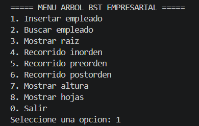
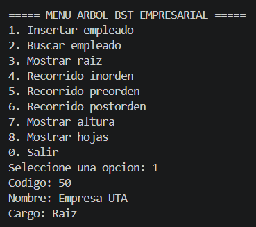
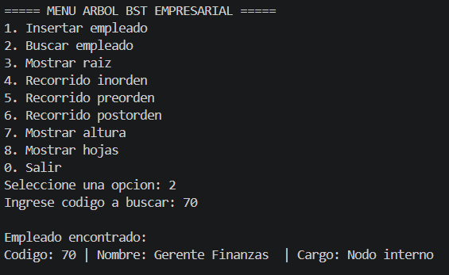
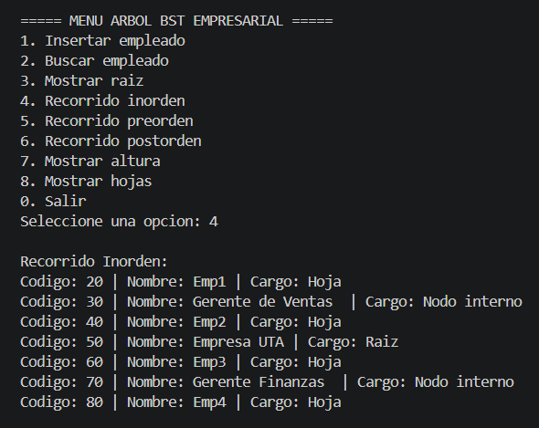
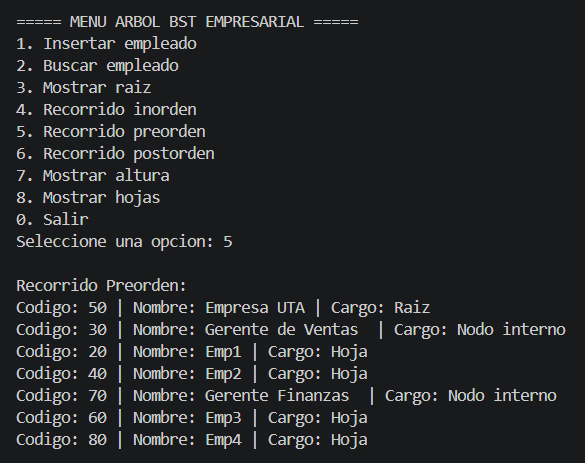
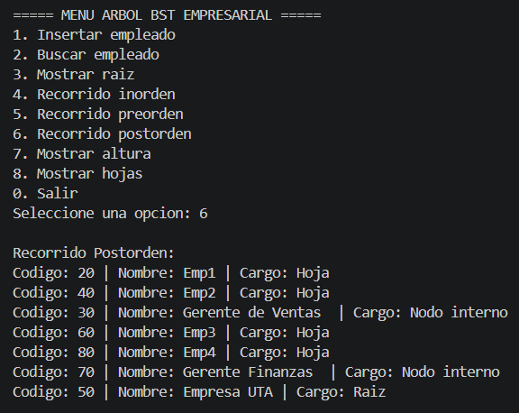
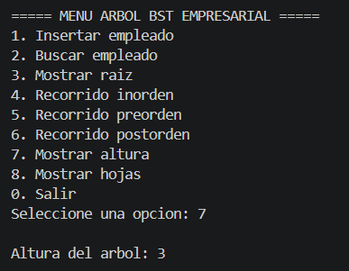
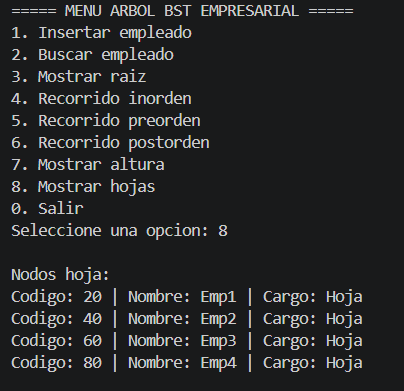

# Árbol BST Empresarial en C++

## Integrantes
- Alexis Nata

## Objetivo
Implementar un árbol binario de búsqueda en C++ para organizar empleados de una empresa
usando un código numérico como clave.

## Funcionalidades
- Insertar empleados
- Buscar empleados
- Mostrar raíz
- Recorridos inorden, preorden y postorden
- Calcular altura
- Mostrar nodos hoja

## Compilación y ejecución
```bash
g++ src/main.cpp -o src/arbol
src/arbol.exe
```

## Conceptos clave
- **Raíz:** Nodo principal del árbol, el primero en insertarse. En este caso el código 50 (Empresa UTA).
- **Nodo interno:** Nodo que tiene al menos un hijo. Ejemplo: códigos 30 y 70.
- **Hoja:** Nodo sin hijos. Ejemplo: códigos 20, 40, 60 y 80.
- **Nivel:** Distancia de un nodo desde la raíz. La raíz está en nivel 0.
- **Altura:** Número total de niveles del árbol. Con estos datos la altura es 3.

## Capturas

### 1. Menú principal

Se muestra el menú con todas las opciones disponibles del sistema BST.

### 2. Inserción de empleados

Se insertaron 7 empleados con sus códigos, nombres y cargos. El primer empleado insertado se convierte en la raíz del árbol.

### 3. Búsqueda de empleado

El árbol recorre los nodos comparando códigos hasta encontrar al empleado solicitado.

### 4. Recorrido Inorden

Visita los nodos en orden: izquierda → raíz → derecha. Muestra los empleados ordenados de menor a mayor código.

### 5. Recorrido Preorden

Visita los nodos en orden: raíz → izquierda → derecha. Empieza desde la raíz y desciende.

### 6. Recorrido Postorden

Visita los nodos en orden: izquierda → derecha → raíz. Los nodos hoja aparecen primero.

### 7. Altura

La altura del árbol es 3, lo que indica que hay 3 niveles desde la raíz hasta la hoja más lejana.

### 8. Nodos hoja

Los nodos hoja son los que no tienen hijos: códigos 20, 40, 60 y 80.

## Conclusión
El árbol binario de búsqueda permite organizar información jerárquica y realizar
búsquedas eficientes con complejidad O(log n), siendo ideal para representar
estructuras como organigramas empresariales.